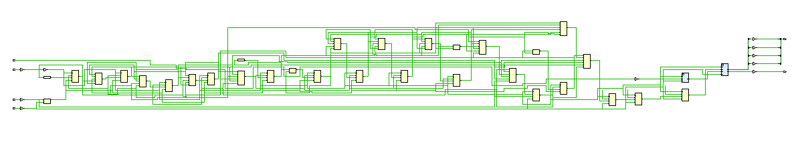
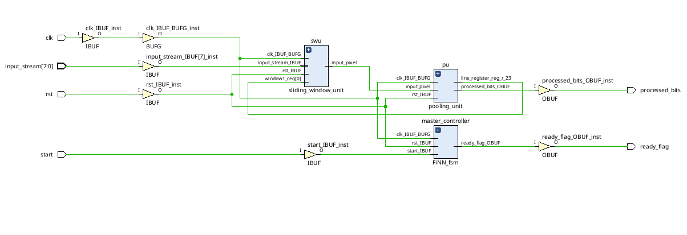
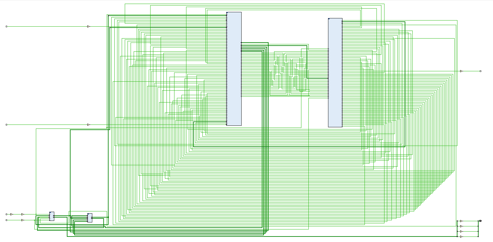
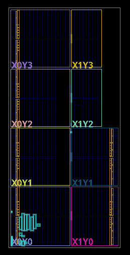
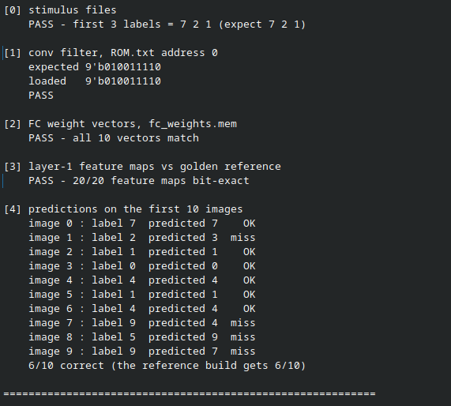

# A Streaming Binarized Neural Network Accelerator for MNIST

<!-- Badges: replace or delete -->

[Kindly note that the README still needs some major updates !!]

Hello everybody! Thank you for checking out this repository. This was done in an effort to create a fully binarized CNN engine written entirely in SystemVerilog. 
The current code is capable of classifying 28 x 28 MNIST digits using simple and easily understandable XNOR, popcount, OR and comparison logic, completely eliminating the need for a MAC unit as one would expect from a CNN engine! (super super cool) 

The architecture is inspired by **FINN: A Framework for Fast, Scalable Binarized Neural Network Inference** (Umuroglu et al., FPGA 2017). The paper implements the core logic through Vivado HLS in a higher level language. While my work is simply an attempt to borrow the aforementioned logic and implement at RTL level. There are plans of integrating more elements in this project, something along the lines of an AXI interface sounds exciting, so does bulding an advanced testbench.

---

## Table of Contents

- [Problem Statement](#problem-statement)
- [Schematics](#schematics)
- [Repository Layout](#repository-layout)

---

## Problem Statement

The conventional approach to CNN more often then not involves floating point MAC (Multiply and accumulate) operation. Essentially meaning that if one decides to implement it on an FPGA, it is bound to take hundreds and thousands of MAC units, drastically increasing the resource usage, another concern while building a CNN engine would be storage of weights. The on-chip memory of a small FPGA would not suffice when storing these floating point weights, this directly affects the power utilization too, since employing off chip memory would increase the power consumption. Conventional CNN inference is dominated by floating-point multiply-accumulate.

The Binarized Neural Network, or BNN, limits our weights to +1 and -1s (1s and 0s) in our case, which significantly reduces our memory requirements. This also boils down the complex mathematical work to its equivalents as follows:

| Floating-point operation | Binarized equivalent |
|---|---|
| Multiply | XNOR |
| Accumulate | Popcount |
| Batch-norm + sign activation | a simple comparator |
| Max-pool | OR |

**The problem this project addresses:** Hardware implementation of an MNIST classifier than holds all parameter on-chip with no usage of DSP slices,holds every parameter on-chip, accepts one pixel stream per clock cycle and predicts the value for the image while also remaining small enough to run on small FPGA.

---

## What This Borrows From FINN

The following concepts are borrowed directly from the FINN paper. Section numbers
refer to the paper.

| FINN concept | Section | Where it appears here |
|---|---|---|
| Popcount and XOR logic for accumulation — count set bits after XNOR instead of signed values using a MAC unit | 4.2.1 | `xnor_popcount.sv` |
| Unsigned threshold comparison instead of the traditional signed batch normalisation | 4.2.2 | `batch_normalisation.sv` |
| Boolean OR for max-pooling, valid because thresholding will give us values between 0 and 1 | 4.2.3 | `pooling_unit.sv` |
| Matrix–Vector–Threshold Unit for mathematical computing | 4.3.1 | `MVTU.sv` |
| Sliding Window Unit built from line buffers and shift registers | 4.3.2 | `sliding_window_unit.sv`, `line_buffer.sv`, `shift_register.sv` |
| Pooling Unit as line buffers plus OR reduction | 4.3.3 | `pooling_unit.sv` |
| Heterogeneous streaming module — one compute engine per layer, connected by streams | 4.1 | `neural_network_top.sv` |

**What is deliberately not implemented:** FINN's folding parameters as proposed in 4.4, feature maps with multiple channels, and the HLS-based design
flow. This design uses a single channel.

---

## Schematics

<!-- Export from Vivado: Open Elaborated Design → Schematic → File → Export → PDF/PNG -->

**Top-level block diagram**

**Layer 1 — convolution and pooling datapath**

**Layer 2 — fully connected and argmax**

**Post-synthesis implemented design**

**Verilator results — digits zero to nine**

---

## Repository Layout

    BNN accelerator/
    ├── docs/                         schematics and waveforms
    │   ├── schematic_top_level.png
    │   ├── schematic_layer1_conv_pool.png
    │   ├── schematic_layer2_fc_argmax.png
    │   ├── vivado_elaborated_schematic.png
    │   ├── vivado_implemented_device.png
    │   └── waveform_single_inference.png
    │
    └── README.md
